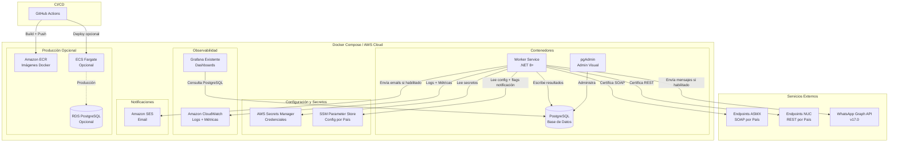
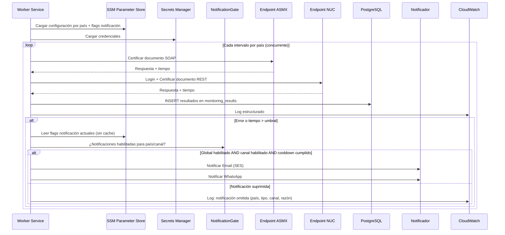
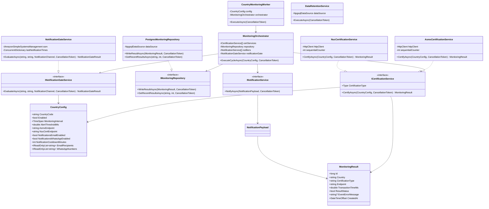
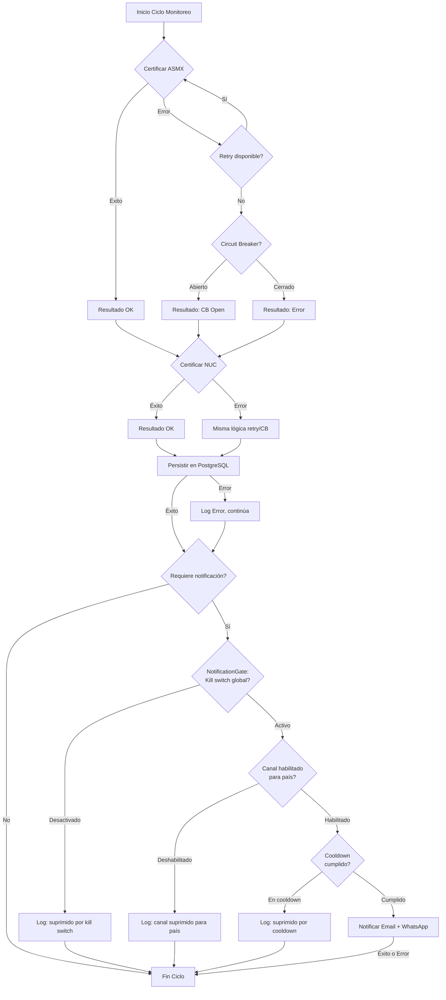

# Documento de Diseño - Servicio Unificado de Monitoreo

## Resumen

Este documento describe el diseño técnico para migrar los 5 servicios de monitoreo de Digifact (GT, SV, DO, CR, PA) a un único .NET 8+ Worker Service. El servicio unificado reemplaza 5 repositorios con código duplicado, God Class y credenciales hardcodeadas por una arquitectura limpia, configurable por país, con persistencia en PostgreSQL (Docker local, opción RDS PostgreSQL en producción), notificaciones via SES y WhatsApp, dashboards en la instancia existente de Grafana conectada a PostgreSQL, y despliegue inicial con Docker Compose con opción de migrar a ECS Fargate.

La migración conserva la lógica de negocio probada (certificación ASMX/NUC, medición de tiempos, alertas multicanal) y la moderniza con inyección de dependencias, resiliencia (Polly), logging estructurado (Serilog), tests automatizados (xUnit + FsCheck) y CI/CD (GitHub Actions). El servicio incluye un sistema de control manual de notificaciones que permite activar/desactivar alertas por país y canal (email/WhatsApp) desde SSM Parameter Store sin reiniciar el servicio, con un kill switch global y cooldown configurable para evitar spam.

## Arquitectura

### Diagrama de Arquitectura General



### Decisiones de Arquitectura

| Decisión | Elección | Justificación |
|----------|----------|---------------|
| Runtime | .NET 8+ Worker Service | LTS, soporte nativo para background services, excelente rendimiento en contenedores |
| Base de datos | PostgreSQL (Docker local, RDS PostgreSQL producción) | Equipo ya maneja PostgreSQL, Grafana ya conectado a SQL, driver Npgsql maduro para .NET |
| Despliegue inicial | Docker Compose | Levanta todo el stack con un comando, incluye PostgreSQL + pgAdmin, rápido para desarrollo y despliegue inicial |
| Despliegue producción | ECS Fargate (opcional) | Migración cuando se requiera escalar, serverless, auto-scaling, sin administrar servidores |
| IaC | AWS CDK en C# (opcional) | Mismo lenguaje que el servicio, type-safe, disponible para cuando se migre a ECS Fargate |
| Resiliencia | Polly v8+ | Estándar de facto en .NET para retry, circuit breaker, timeout. Integración nativa con HttpClientFactory |
| Logging | Serilog + CloudWatch sink | Logging estructurado JSON, enrichers de contexto, sink directo a CloudWatch |
| Dashboards | Grafana existente + PostgreSQL datasource | Instancia ya disponible, datasource nativo PostgreSQL, sin infraestructura adicional |
| Admin local | pgAdmin en Docker Compose | Visualización directa de datos durante desarrollo sin depender de Grafana |
| CI/CD | GitHub Actions | Ya usado en la organización Digifact-FEL, integración directa con ECR |
| Testing | xUnit + FsCheck | xUnit es el estándar en .NET, FsCheck para property-based testing |
| Driver PostgreSQL | Npgsql con connection pooling | Driver oficial PostgreSQL para .NET, alto rendimiento, soporte connection pooling nativo |

### Flujo de Ejecución Principal



## Componentes e Interfaces

### Estructura del Proyecto

```
ServicioMonitoreo/
├── src/
│   ├── Monitoreo.Worker/                    # Worker Service principal
│   │   ├── Workers/
│   │   │   └── CountryMonitoringWorker.cs   # BackgroundService por país
│   │   ├── Services/
│   │   │   ├── Certification/
│   │   │   │   ├── ICertificationService.cs
│   │   │   │   ├── AsmxCertificationService.cs
│   │   │   │   └── NucCertificationService.cs
│   │   │   ├── Notification/
│   │   │   │   ├── INotificationService.cs
│   │   │   │   ├── INotificationGateService.cs
│   │   │   │   ├── NotificationGateService.cs
│   │   │   │   ├── EmailNotificationService.cs
│   │   │   │   └── WhatsAppNotificationService.cs
│   │   │   ├── Persistence/
│   │   │   │   ├── IMonitoringRepository.cs
│   │   │   │   └── PostgresMonitoringRepository.cs
│   │   │   ├── Configuration/
│   │   │   │   ├── IConfigurationProvider.cs
│   │   │   │   └── AwsConfigurationProvider.cs
│   │   │   ├── Retention/
│   │   │   │   └── DataRetentionService.cs
│   │   │   └── Orchestration/
│   │   │       ├── IMonitoringOrchestrator.cs
│   │   │       └── MonitoringOrchestrator.cs
│   │   ├── Models/
│   │   │   ├── MonitoringResult.cs
│   │   │   ├── CountryConfig.cs
│   │   │   ├── CertificationType.cs
│   │   │   └── NotificationPayload.cs
│   │   ├── Templates/
│   │   │   ├── GT/
│   │   │   │   ├── asmx-template.xml
│   │   │   │   └── nuc-template.xml
│   │   │   └── ... (SV, DO, CR, PA)
│   │   ├── Health/
│   │   │   └── MonitoringHealthCheck.cs
│   │   ├── Database/
│   │   │   └── init.sql
│   │   ├── Grafana/
│   │   │   └── dashboard.json
│   │   ├── Queries/
│   │   │   └── test-queries.sql
│   │   ├── Program.cs
│   │   ├── Dockerfile
│   │   ├── appsettings.json
│   │   ├── appsettings.GT.json
│   │   ├── appsettings.SV.json
│   │   ├── appsettings.DO.json
│   │   ├── appsettings.CR.json
│   │   └── appsettings.PA.json
│   └── Monitoreo.Infrastructure/             # CDK Stack (opcional)
│       ├── MonitoreoStack.cs
│       ├── Constructs/
│       │   ├── PostgresConstruct.cs
│       │   ├── EcsConstruct.cs
│       │   └── ObservabilityConstruct.cs
│       └── Program.cs
├── tests/
│   ├── Monitoreo.Worker.UnitTests/
│   │   ├── Services/
│   │   │   ├── AsmxCertificationServiceTests.cs
│   │   │   ├── NucCertificationServiceTests.cs
│   │   │   ├── EmailNotificationServiceTests.cs
│   │   │   ├── WhatsAppNotificationServiceTests.cs
│   │   │   ├── NotificationGateServiceTests.cs
│   │   │   ├── PostgresRepositoryTests.cs
│   │   │   └── MonitoringOrchestratorTests.cs
│   │   ├── Properties/
│   │   │   ├── MonitoringResultPropertyTests.cs
│   │   │   ├── ConfigurationPropertyTests.cs
│   │   │   ├── NotificationPropertyTests.cs
│   │   │   └── NotificationGatePropertyTests.cs
│   │   └── Models/
│   │       └── MonitoringResultTests.cs
│   └── Monitoreo.Worker.IntegrationTests/
│       ├── PostgresIntegrationTests.cs
│       └── MonitoringFlowIntegrationTests.cs
├── .github/
│   └── workflows/
│       └── ci-cd.yml
├── docker-compose.yml
├── pgadmin-servers.json
└── README.md
```

### Interfaces Principales

```csharp
// ICertificationService.cs
public interface ICertificationService
{
    Task<MonitoringResult> CertifyAsync(CountryConfig config, CancellationToken ct);
    CertificationType Type { get; }
}

// IMonitoringRepository.cs
public interface IMonitoringRepository
{
    Task WriteResultAsync(MonitoringResult result, CancellationToken ct);
    Task<IReadOnlyList<MonitoringResult>> GetRecentResultsAsync(string country, int limit, CancellationToken ct);
}

// INotificationService.cs
public interface INotificationService
{
    Task NotifyAsync(NotificationPayload payload, CancellationToken ct);
}

// IMonitoringOrchestrator.cs
public interface IMonitoringOrchestrator
{
    Task ExecuteCycleAsync(CountryConfig config, CancellationToken ct);
}

// IConfigurationProvider.cs
public interface IConfigurationProvider
{
    Task<IReadOnlyList<CountryConfig>> LoadAllCountriesAsync(CancellationToken ct);
    Task<CountryConfig> LoadCountryAsync(string countryCode, CancellationToken ct);
}

// INotificationGateService.cs
public interface INotificationGateService
{
    /// <summary>
    /// Evalúa si una notificación debe enviarse según los flags de control manual,
    /// el kill switch global y el cooldown configurado.
    /// </summary>
    Task<NotificationGateResult> EvaluateAsync(string countryCode, string certType, NotificationChannel channel, CancellationToken ct);
}

public record NotificationGateResult(bool IsAllowed, string? SuppressedReason);

public enum NotificationChannel { Email, WhatsApp }
```

### Componente: CountryMonitoringWorker

Responsabilidad: BackgroundService que programa y ejecuta ciclos de monitoreo por país de forma independiente y concurrente.

```csharp
public class CountryMonitoringWorker : BackgroundService
{
    // Se registra una instancia por país habilitado
    // Usa PeriodicTimer con el intervalo de País_Config
    // Delega la ejecución al IMonitoringOrchestrator
    // Maneja errores sin detener el ciclo
}
```

Comportamiento:
- Al iniciar, carga la configuración del país asignado via `IConfigurationProvider`
- Ejecuta `IMonitoringOrchestrator.ExecuteCycleAsync()` en cada tick del timer
- Si el orquestador lanza una excepción, la registra en logs y espera al siguiente tick
- Cada país corre en su propio `BackgroundService`, permitiendo concurrencia sin bloqueo

### Componente: MonitoringOrchestrator

Responsabilidad: Coordina un ciclo completo de monitoreo para un país: ejecuta ambas certificaciones, persiste resultados, consulta el gate de notificaciones y dispara notificaciones solo si están habilitadas.

```csharp
public class MonitoringOrchestrator : IMonitoringOrchestrator
{
    // Inyecta: ICertificationService[] (ASMX + NUC)
    //          IMonitoringRepository
    //          INotificationService[] (Email + WhatsApp)
    //          INotificationGateService
    //          ILogger<MonitoringOrchestrator>
    
    // ExecuteCycleAsync:
    // 1. Ejecuta ASMX y NUC (pueden ser paralelas o secuenciales según config)
    // 2. Persiste cada resultado via IMonitoringRepository (SIEMPRE, independiente de flags de notificación)
    // 3. Evalúa si algún resultado requiere notificación (fallo o tiempo > umbral)
    // 4. Para cada canal (Email, WhatsApp), consulta INotificationGateService.EvaluateAsync()
    // 5. Si el gate permite el canal → dispara notificación
    // 6. Si el gate suprime el canal → registra log con razón de supresión (país, tipo, canal)
}
```

### Componente: AsmxCertificationService

Responsabilidad: Certifica documentos de prueba via SOAP contra endpoints ASMX. Reutiliza los patrones de los repos existentes (Service1.cs) pero con arquitectura limpia.

- Lee la plantilla XML del país desde disco (ruta configurable en `CountryConfig.AsmxTemplatePath`)
- Modifica campos dinámicos: Clave, FechaEmision, Consecutivo
- Incrementa el consecutivo de forma atómica usando `Interlocked.Increment`
- Envía la solicitud SOAP via `HttpClient` (configurado con Polly para retry y circuit breaker)
- Mide el tiempo de respuesta con `Stopwatch`
- Retorna un `MonitoringResult` con el resultado

### Componente: NucCertificationService

Responsabilidad: Certifica documentos de prueba via API REST NUC. Reutiliza los patrones de los repos existentes.

- Obtiene token de autenticación via POST al endpoint de login NUC
- Prepara la plantilla XML NUC con campos dinámicos actualizados (IssuedDateTime, Consecutivo)
- Envía POST al endpoint de certificación con el token en el header Authorization
- Parsea la respuesta JSON (code, message, description, infoDetails)
- Mide el tiempo de respuesta total (login + certificación)
- Retorna un `MonitoringResult`

### Componente: PostgresMonitoringRepository

Responsabilidad: Persiste resultados de monitoreo en PostgreSQL usando Npgsql.

- Usa `NpgsqlDataSource` con connection pooling integrado
- Ejecuta INSERT en la tabla `monitoring_results` con parámetros tipados
- Soporta lectura de resultados recientes para consultas internas
- Connection string configurable via variable de ambiente o Secrets Manager
- Implementa retry en caso de fallo de escritura (delegado a Polly)

### Componente: EmailNotificationService

Responsabilidad: Envía alertas por email via Amazon SES.

- Usa `AmazonSimpleEmailServiceV2Client` del SDK de AWS (AWSSDK.SimpleEmailV2)
- Construye el email con información del país, tipo de certificación, tiempo de respuesta y error
- Envía a todos los destinatarios configurados en `CountryConfig.EmailRecipients`

### Componente: WhatsAppNotificationService

Responsabilidad: Envía alertas por WhatsApp via Graph API.

- Usa `HttpClient` configurado con Polly para llamar a la Graph API v17.0
- Construye el payload JSON usando serialización estructurada (`System.Text.Json`) — no concatenación de strings
- Usa el template `monitoring_response_mp`
- Envía a todos los números configurados en `CountryConfig.WhatsAppNumbers`

### Componente: AwsConfigurationProvider

Responsabilidad: Carga configuración desde SSM Parameter Store y Secrets Manager.

- Lee parámetros de SSM con jerarquía `/monitoreo/{ambiente}/{pais}/`
- Lee secretos de Secrets Manager para credenciales sensibles
- Lee flags de notificación desde SSM (global y por país)
- Para desarrollo local, soporta fallback a `appsettings.{PAIS}.json`
- Valida que todos los campos obligatorios estén presentes
- Retorna `CountryConfig` validados o registra errores descriptivos sin exponer credenciales

### Componente: NotificationGateService

Responsabilidad: Evalúa si una notificación debe enviarse según los controles manuales configurados en SSM Parameter Store. Actúa como "portero" entre la lógica de detección de alertas y el envío real de notificaciones.

- Lee el flag global `notifications_enabled` desde SSM en cada evaluación (sin cache, para detectar cambios sin reiniciar)
- Lee los flags por país `notifications_email_enabled` y `notifications_whatsapp_enabled` desde `CountryConfig`
- Verifica el cooldown: consulta el timestamp de la última notificación enviada para ese país/tipo/canal y compara con `notification_cooldown_minutes`
- Mantiene un `ConcurrentDictionary<string, DateTimeOffset>` en memoria para trackear los timestamps de última notificación por clave `{country}_{certType}_{channel}`
- Retorna `NotificationGateResult` con `IsAllowed` y `SuppressedReason` (para logging)

Lógica de evaluación (en orden):
1. Si `notifications_enabled` global es `false` → suprimido, razón: "Kill switch global desactivado"
2. Si el canal es Email y `notifications_email_enabled` del país es `false` → suprimido, razón: "Email deshabilitado para {país}"
3. Si el canal es WhatsApp y `notifications_whatsapp_enabled` del país es `false` → suprimido, razón: "WhatsApp deshabilitado para {país}"
4. Si la última notificación para `{country}_{certType}_{channel}` fue hace menos de `notification_cooldown_minutes` → suprimido, razón: "Cooldown activo ({X} min restantes)"
5. Si pasa todas las verificaciones → permitido

```csharp
public class NotificationGateService : INotificationGateService
{
    private readonly IAmazonSimpleSystemsManagement _ssm;
    private readonly ConcurrentDictionary<string, DateTimeOffset> _lastNotificationTimes = new();
    private readonly ILogger<NotificationGateService> _logger;

    public async Task<NotificationGateResult> EvaluateAsync(
        string countryCode, string certType, NotificationChannel channel, CancellationToken ct)
    {
        // 1. Leer kill switch global desde SSM (sin cache)
        // 2. Verificar flag del canal para el país
        // 3. Verificar cooldown
        // 4. Si permitido, actualizar timestamp de última notificación
    }
}
```

### Componente: DataRetentionService

Responsabilidad: Ejecuta limpieza periódica de datos antiguos en PostgreSQL.

- Se ejecuta como un `BackgroundService` adicional con schedule configurable (default: diariamente 2 AM)
- Ejecuta DELETE de registros con `created_at` mayor a 365 días
- Registra en logs la cantidad de registros eliminados
- Si falla, registra el error sin afectar los ciclos de monitoreo

### Componente: MonitoringHealthCheck

Responsabilidad: Expone endpoint de health check.

- Implementa `IHealthCheck` de ASP.NET Core
- Verifica conectividad con PostgreSQL
- Reporta estado general del servicio

### Diagrama de Relación de Componentes



## Modelos de Datos

### MonitoringResult

Modelo principal que representa el resultado de una certificación de prueba. Mapea directamente a la tabla `monitoring_results` en PostgreSQL.

```csharp
public record MonitoringResult
{
    public long Id { get; init; }                            // BIGSERIAL PK (asignado por PostgreSQL)
    public required string Country { get; init; }            // "GT", "SV", "DO", "CR", "PA"
    public required string CertificationType { get; init; }  // "ASMX" o "NUC"
    public required string Endpoint { get; init; }           // URL del endpoint certificado
    public required double TransactionTimeMs { get; init; }  // Tiempo de respuesta en ms
    public required bool ResultStatus { get; init; }         // true = éxito, false = fallo
    public string? EventErrorMessage { get; init; }          // Mensaje de error (null si éxito)
    public DateTimeOffset CreatedAt { get; init; }           // Timestamp (default NOW() en PostgreSQL)
}
```

### CountryConfig

Configuración completa de un país para monitoreo.

```csharp
public record CountryConfig
{
    public required string CountryCode { get; init; }       // "GT", "SV", etc.
    public required bool Enabled { get; init; }             // País habilitado/deshabilitado
    public required TimeSpan MonitoringInterval { get; init; } // Intervalo entre ciclos
    public required double AlertThresholdMs { get; init; }  // Umbral de alerta en ms (default: 5000)
    
    // Endpoints
    public required string AsmxEndpoint { get; init; }      // URL endpoint ASMX
    public required string NucLoginEndpoint { get; init; }   // URL login NUC
    public required string NucCertEndpoint { get; init; }    // URL certificación NUC
    
    // Templates
    public required string AsmxTemplatePath { get; init; }   // Ruta plantilla XML ASMX
    public required string NucTemplatePath { get; init; }    // Ruta plantilla XML NUC
    
    // Notificaciones - Destinatarios
    public required IReadOnlyList<string> EmailRecipients { get; init; }
    public required IReadOnlyList<string> WhatsAppNumbers { get; init; }
    
    // Notificaciones - Control Manual (Req 7)
    public bool NotificationsEmailEnabled { get; init; } = true;      // Toggle email por país
    public bool NotificationsWhatsAppEnabled { get; init; } = true;   // Toggle WhatsApp por país
    public int NotificationCooldownMinutes { get; init; } = 15;       // Cooldown entre notificaciones del mismo tipo/país
    
    // Credenciales (referencia a Secrets Manager, no el valor)
    public required string NucCredentialSecretArn { get; init; }
    public required string WhatsAppTokenSecretArn { get; init; }
}
```

### NotificationPayload

Datos para construir una notificación (email o WhatsApp).

```csharp
public record NotificationPayload
{
    public required MonitoringResult Result { get; init; }
    public required NotificationType Type { get; init; }    // Error o Degradation
    public required IReadOnlyList<string> Recipients { get; init; } // Emails o números WhatsApp
}

public enum NotificationType
{
    Error,        // Certificación fallida
    Degradation   // Tiempo > umbral
}
```

### Esquema PostgreSQL

#### Tabla: monitoring_results

```sql
CREATE TABLE IF NOT EXISTS monitoring_results (
    id                  BIGSERIAL PRIMARY KEY,
    country             VARCHAR(5) NOT NULL,
    certification_type  VARCHAR(10) NOT NULL,
    endpoint            VARCHAR(500) NOT NULL,
    transaction_time_ms DOUBLE PRECISION NOT NULL,
    result_status       BOOLEAN NOT NULL,
    event_error_message TEXT NULL,
    created_at          TIMESTAMPTZ NOT NULL DEFAULT NOW()
);

-- Índices para optimizar consultas de Grafana
CREATE INDEX IF NOT EXISTS idx_monitoring_country_type_date 
    ON monitoring_results (country, certification_type, created_at DESC);

CREATE INDEX IF NOT EXISTS idx_monitoring_created_at 
    ON monitoring_results (created_at DESC);
```

#### Vista: monitoring_summary

```sql
CREATE OR REPLACE VIEW monitoring_summary AS
SELECT 
    country,
    certification_type,
    -- Último resultado
    (SELECT transaction_time_ms FROM monitoring_results mr2 
     WHERE mr2.country = mr.country AND mr2.certification_type = mr.certification_type 
     ORDER BY created_at DESC LIMIT 1) AS last_transaction_time_ms,
    -- Promedio últimas 24h
    AVG(CASE WHEN created_at >= NOW() - INTERVAL '24 hours' THEN transaction_time_ms END) AS avg_24h_ms,
    -- Conteos últimas 24h
    COUNT(CASE WHEN created_at >= NOW() - INTERVAL '24 hours' AND result_status = true THEN 1 END) AS success_count_24h,
    COUNT(CASE WHEN created_at >= NOW() - INTERVAL '24 hours' AND result_status = false THEN 1 END) AS failure_count_24h,
    -- Último error
    (SELECT event_error_message FROM monitoring_results mr3 
     WHERE mr3.country = mr.country AND mr3.certification_type = mr.certification_type 
       AND mr3.result_status = false 
     ORDER BY created_at DESC LIMIT 1) AS last_error_message
FROM monitoring_results mr
GROUP BY country, certification_type;
```

#### Script de inicialización (init.sql)

El archivo `Database/init.sql` se ejecuta automáticamente al levantar PostgreSQL en Docker Compose. Incluye:
- Creación de la tabla `monitoring_results` con índices
- Creación de la vista `monitoring_summary`

### Esquema SSM Parameter Store

Jerarquía de parámetros en SSM:

```
/monitoreo/{ambiente}/global/
    notifications-enabled           = "true"          # Kill switch global para todas las notificaciones
    alert-threshold-ms              = "5000"
    whatsapp-template-name          = "monitoring_response_mp"
    whatsapp-api-version            = "v17.0"
    retention-days                  = "365"
    cleanup-cron                    = "0 2 * * *"

/monitoreo/{ambiente}/{pais}/
    enabled                         = "true"
    monitoring-interval-minutes     = "5"
    asmx-endpoint                   = "https://..."
    nuc-login-endpoint              = "https://..."
    nuc-cert-endpoint               = "https://..."
    asmx-template-path              = "Templates/GT/asmx-template.xml"
    nuc-template-path               = "Templates/GT/nuc-template.xml"
    email-recipients                = "ops@digifact.com,alerts@digifact.com"
    whatsapp-numbers                = "+502XXXXXXXX,+502YYYYYYYY"
    notifications-email-enabled     = "true"          # Toggle email por país
    notifications-whatsapp-enabled  = "true"          # Toggle WhatsApp por país
    notification-cooldown-minutes   = "15"            # Cooldown entre notificaciones mismo tipo/país
```

### Esquema Secrets Manager

```
/monitoreo/{ambiente}/{pais}/nuc-credentials
    {
        "username": "...",
        "password": "..."
    }

/monitoreo/{ambiente}/whatsapp-token
    {
        "token": "...",
        "phone_number_id": "..."
    }

/monitoreo/{ambiente}/ses-config
    {
        "sender_email": "monitoreo@digifact.com",
        "region": "us-east-1"
    }

/monitoreo/{ambiente}/postgres-connection
    {
        "connection_string": "Host=...;Database=monitoring;Username=...;Password=..."
    }
```

### Docker Compose

```yaml
# docker-compose.yml
services:
  worker:
    build:
      context: .
      dockerfile: src/Monitoreo.Worker/Dockerfile
    depends_on:
      postgres:
        condition: service_healthy
    environment:
      - ASPNETCORE_ENVIRONMENT=Development
      - ConnectionStrings__PostgreSQL=Host=postgres;Database=monitoring;Username=monitoreo;Password=${POSTGRES_PASSWORD}
    restart: unless-stopped

  postgres:
    image: postgres:16-alpine
    environment:
      POSTGRES_DB: monitoring
      POSTGRES_USER: monitoreo
      POSTGRES_PASSWORD: ${POSTGRES_PASSWORD}
    volumes:
      - postgres_data:/var/lib/postgresql/data
      - ./src/Monitoreo.Worker/Database/init.sql:/docker-entrypoint-initdb.d/init.sql
    ports:
      - "5432:5432"
    healthcheck:
      test: ["CMD-SHELL", "pg_isready -U monitoreo -d monitoring"]
      interval: 10s
      timeout: 5s
      retries: 5

  pgadmin:
    image: dpage/pgadmin4:latest
    environment:
      PGADMIN_DEFAULT_EMAIL: admin@digifact.com
      PGADMIN_DEFAULT_PASSWORD: ${PGADMIN_PASSWORD}
      PGADMIN_CONFIG_SERVER_MODE: "False"
    volumes:
      - ./pgadmin-servers.json:/pgadmin4/servers.json
    ports:
      - "5050:80"
    depends_on:
      postgres:
        condition: service_healthy

volumes:
  postgres_data:
```

## Propiedades de Correctitud

*Una propiedad es una característica o comportamiento que debe mantenerse verdadero en todas las ejecuciones válidas de un sistema — esencialmente, una declaración formal sobre lo que el sistema debe hacer. Las propiedades sirven como puente entre especificaciones legibles por humanos y garantías de correctitud verificables por máquina.*

### Propiedad 1: Solo países habilitados se programan

*Para cualquier* conjunto de configuraciones de país (`CountryConfig[]`), el número de workers de monitoreo programados debe ser exactamente igual al número de países donde `Enabled == true`. Ningún país deshabilitado debe tener un ciclo de monitoreo activo.

**Valida: Requerimientos 1.2**

### Propiedad 2: Cada ciclo produce ambos tipos de certificación

*Para cualquier* país habilitado y cualquier ciclo de monitoreo ejecutado, el resultado debe contener exactamente 2 registros de `MonitoringResult`: uno con `CertificationType == "ASMX"` y otro con `CertificationType == "NUC"`, ambos con el mismo `Country`.

**Valida: Requerimientos 1.4**

### Propiedad 3: Inyección de campos dinámicos en plantillas XML

*Para cualquier* plantilla XML válida (ASMX o NUC) y cualquier conjunto de valores dinámicos (Clave, FechaEmision, Consecutivo, IssuedDateTime), el XML resultante debe contener exactamente los valores dinámicos proporcionados en las posiciones correspondientes, y el resto del XML debe permanecer idéntico a la plantilla original.

**Valida: Requerimientos 2.1, 3.2**

### Propiedad 4: Invariante de construcción de MonitoringResult

*Para cualquier* resultado de certificación (ASMX o NUC), el `MonitoringResult` generado debe cumplir: si `ResultStatus == true` entonces `EventErrorMessage` debe ser `null` y `TransactionTimeMs >= 0`; si `ResultStatus == false` entonces `EventErrorMessage` debe ser no-nulo y no-vacío. En ambos casos, `Country` debe ser un código válido (GT, SV, DO, CR, PA), `CertificationType` debe ser "ASMX" o "NUC", y `Endpoint` debe ser no-vacío.

**Valida: Requerimientos 2.3, 2.4, 3.3, 3.5, 4.2**

### Propiedad 5: Unicidad de consecutivos atómicos

*Para cualquier* número N de incrementos concurrentes del consecutivo de certificación, todos los N valores resultantes deben ser únicos (sin colisiones), y el valor final del contador debe ser exactamente el valor inicial + N.

**Valida: Requerimientos 2.5**

### Propiedad 6: Round-trip de persistencia en PostgreSQL

*Para cualquier* `MonitoringResult` válido, escribirlo en PostgreSQL y luego leerlo de vuelta debe producir un objeto equivalente al original en todos sus campos (country, certification_type, endpoint, transaction_time_ms, result_status, event_error_message, created_at).

**Valida: Requerimientos 4.1, 13.3**

### Propiedad 7: Lógica de disparo de notificaciones con control manual

*Para cualquier* `MonitoringResult`, umbral de alerta configurado, y estado de flags de notificación (`notifications_enabled` global, `notifications_email_enabled` por país, `notifications_whatsapp_enabled` por país), se debe disparar una notificación por un canal dado si y solo si: (1) `ResultStatus == false` O `TransactionTimeMs > AlertThresholdMs`, Y (2) el kill switch global está activo, Y (3) el flag del canal específico para ese país está activo, Y (4) el cooldown para ese país/tipo/canal ha expirado. Si cualquiera de estas condiciones no se cumple, la notificación debe ser suprimida.

**Valida: Requerimientos 5.1, 5.2, 6.1, 6.2, 7.1, 7.2, 7.3, 7.4**

### Propiedad 8: Completitud y validez del contenido de notificaciones

*Para cualquier* `NotificationPayload`, el contenido renderizado (email o WhatsApp) debe incluir: país afectado, tipo de certificación, tiempo de respuesta, mensaje de error (si aplica) y timestamp. Además, el payload JSON de WhatsApp debe ser JSON válido parseable.

**Valida: Requerimientos 5.3, 6.3**

### Propiedad 9: Enmascaramiento de credenciales en logs

*Para cualquier* mensaje de log generado por el sistema que contenga información de error de servicios externos, el mensaje no debe contener valores de credenciales sensibles (tokens, passwords, connection strings). Si se detecta un patrón de credencial en un mensaje de error externo, debe ser reemplazado por un placeholder de enmascaramiento.

**Valida: Requerimientos 8.3, 8.4 (Gestión Segura de Credenciales)**

### Propiedad 10: Validación de CountryConfig

*Para cualquier* `CountryConfig`, la validación debe pasar si y solo si todos los campos obligatorios (CountryCode, AsmxEndpoint, NucLoginEndpoint, NucCertEndpoint, MonitoringInterval > 0, AlertThresholdMs > 0, AsmxTemplatePath, NucTemplatePath, al menos un EmailRecipient, al menos un WhatsAppNumber, NotificationCooldownMinutes >= 0) están presentes y son válidos. Si algún campo obligatorio falta o es inválido, la validación debe fallar con un mensaje descriptivo que identifique el campo faltante.

**Valida: Requerimientos 8.3, 8.4 (Configuración Multi-País), 7.1**

### Propiedad 11: Completitud de logs estructurados

*Para cualquier* evento de monitoreo completado (éxito o error), el log estructurado generado debe contener los campos: country, certification_type, duration_ms y result. Adicionalmente, si el evento es un error, debe incluir error_message y stack_trace.

**Valida: Requerimientos 10.3, 10.4**

### Propiedad 12: Correctitud de retención de datos

*Para cualquier* conjunto de registros en `monitoring_results` con distintas fechas de `created_at`, la tarea de limpieza debe eliminar exactamente aquellos registros donde `created_at` es mayor a 365 días de antigüedad, y preservar todos los registros más recientes sin modificación.

**Valida: Requerimientos 15.1**

### Propiedad 13: Cooldown de notificaciones previene spam

*Para cualquier* secuencia de N notificaciones del mismo tipo para el mismo país y canal, si todas ocurren dentro de una ventana de `notification_cooldown_minutes` minutos, solo la primera notificación debe enviarse efectivamente. Las N-1 restantes deben ser suprimidas por cooldown. Además, una notificación que ocurra después de que el cooldown haya expirado debe enviarse normalmente.

**Valida: Requerimientos 7.7**

### Propiedad 14: Monitoreo continúa independiente de flags de notificación

*Para cualquier* combinación de flags de notificación (global desactivado, email desactivado, WhatsApp desactivado, cualquier combinación), el ciclo de monitoreo debe seguir ejecutándose y los resultados deben seguir persistiéndose en PostgreSQL_DB. La cantidad de registros en `monitoring_results` no debe verse afectada por el estado de los flags de notificación.

**Valida: Requerimientos 7.2, 7.3**

## Manejo de Errores

### Estrategia General

El servicio sigue el principio de "fallar parcialmente, nunca completamente": un error en un componente o país no debe detener el monitoreo de los demás. Cada capa tiene su propia estrategia de manejo de errores.

### Errores por Capa

#### Capa de Certificación (ASMX / NUC)

| Error | Estrategia | Resultado |
|-------|-----------|-----------|
| Timeout HTTP | Polly retry con backoff exponencial (3 intentos: 1s, 2s, 4s) | Si agota retries → `MonitoringResult` con `ResultStatus=false` |
| Error de red (DNS, conexión) | Polly retry con backoff exponencial | Si agota retries → `MonitoringResult` con `ResultStatus=false` |
| Respuesta HTTP no-2xx | No retry (error del servidor remoto) | `MonitoringResult` con `ResultStatus=false` y código HTTP en `EventErrorMessage` |
| XML de respuesta inválido | No retry | `MonitoringResult` con `ResultStatus=false` y detalle del error de parsing |
| Token NUC expirado/inválido | Retry una vez con nuevo token | Si falla de nuevo → `MonitoringResult` con `ResultStatus=false` |
| Circuit breaker abierto | No intenta la llamada | `MonitoringResult` con `ResultStatus=false` y mensaje "Circuit breaker open for {endpoint}" |

Configuración de Circuit Breaker por endpoint:
- Umbral de apertura: 5 fallos consecutivos (configurable)
- Duración de apertura: 30 segundos (configurable)
- Intentos en half-open: 1

#### Capa de Persistencia (PostgreSQL)

| Error | Estrategia | Resultado |
|-------|-----------|-----------|
| Conexión perdida | Retry con backoff (3 intentos) | Si agota retries → log Error en CloudWatch, ciclo continúa |
| Timeout de escritura | Retry con backoff (2 intentos) | Si agota retries → log Error en CloudWatch |
| Constraint violation | No retry (bug en el código) | Log Error con detalle, ciclo continúa |
| Pool de conexiones agotado | Espera con timeout configurable | Si timeout → log Error, ciclo continúa |

La pérdida de un resultado de monitoreo por fallo de PostgreSQL es aceptable; lo crítico es que el ciclo de monitoreo no se detenga.

#### Capa de Notificaciones (SES / WhatsApp)

| Error | Estrategia | Resultado |
|-------|-----------|-----------|
| SES throttling | Retry con backoff (2 intentos) | Si agota retries → log Warning en CloudWatch |
| SES bounce/complaint | No retry | Log Warning con detalle del bounce |
| WhatsApp API error | Retry con backoff (2 intentos) | Si agota retries → log Warning en CloudWatch |
| WhatsApp rate limit | Retry después del tiempo indicado en la respuesta | Si agota retries → log Warning |
| Template WhatsApp no encontrado | No retry (error de configuración) | Log Error con nombre del template |

Las notificaciones son "best effort": un fallo en notificación nunca debe afectar el ciclo de monitoreo ni la persistencia.

#### Capa de Control de Notificaciones (NotificationGate)

| Error | Estrategia | Resultado |
|-------|-----------|-----------|
| SSM no disponible al leer kill switch | Retry con backoff (2 intentos) | Si agota retries → asumir notificaciones habilitadas (fail-open), log Warning |
| Parámetro SSM de notificación faltante | No retry | Asumir valor por defecto (habilitado), log Warning |
| Error al leer flags por país | No retry | Usar valores de CountryConfig cargados al inicio, log Warning |

El NotificationGate sigue una política "fail-open": si no puede determinar el estado de los flags, permite la notificación para no perder alertas críticas. Los errores del gate nunca deben impedir el monitoreo ni la persistencia.

#### Capa de Configuración (SSM / Secrets Manager)

| Error | Estrategia | Resultado |
|-------|-----------|-----------|
| SSM no disponible al inicio | Retry con backoff (5 intentos) | Si agota retries → fallback a appsettings.json local |
| Secrets Manager no disponible | Retry con backoff (5 intentos) | Si agota retries → log Critical, país deshabilitado |
| Parámetro SSM faltante | No retry | Log Error descriptivo, país deshabilitado |
| Secreto faltante | No retry | Log Error descriptivo (sin exponer el nombre del secreto esperado), país deshabilitado |
| Credencial inválida/expirada | Detectado en runtime | Log Error, notificación al equipo de ops |

#### Capa de Retención de Datos

| Error | Estrategia | Resultado |
|-------|-----------|-----------|
| DELETE falla por lock | Retry con backoff (2 intentos) | Si agota retries → log Warning, reintenta en siguiente schedule |
| Conexión perdida durante cleanup | Retry con backoff (2 intentos) | Si agota retries → log Error |

La limpieza de datos es una operación de mantenimiento; su fallo nunca debe impactar los ciclos de monitoreo activos.

### Diagrama de Flujo de Errores



### Logging de Errores

Todos los errores se registran con Serilog en formato JSON estructurado con los siguientes campos mínimos:

```json
{
  "Timestamp": "2024-01-15T10:30:00Z",
  "Level": "Error",
  "MessageTemplate": "Certification failed for {Country} {CertType}",
  "Properties": {
    "Country": "GT",
    "CertType": "ASMX",
    "Endpoint": "https://...",
    "ErrorType": "HttpRequestException",
    "ErrorMessage": "Connection refused",
    "RetryAttempt": 3,
    "CircuitBreakerState": "Closed",
    "CorrelationId": "abc-123"
  },
  "Exception": "..."
}
```

## Estrategia de Testing

### Enfoque Dual: Tests Unitarios + Property-Based Testing

El proyecto usa un enfoque complementario de testing:

- **Tests unitarios (xUnit)**: Verifican ejemplos específicos, edge cases y condiciones de error con mocks de dependencias externas
- **Property-based tests (FsCheck)**: Verifican propiedades universales que deben cumplirse para todas las entradas válidas generadas aleatoriamente

Ambos son necesarios: los tests unitarios atrapan bugs concretos y validan integraciones, los property tests verifican correctitud general.

### Librería de Property-Based Testing

- **Librería**: FsCheck (https://fscheck.github.io/FsCheck/) con integración xUnit via `FsCheck.Xunit`
- **Justificación**: FsCheck es la librería PBT más madura para .NET, con generadores potentes, shrinking automático y excelente integración con xUnit
- **Configuración**: Mínimo 100 iteraciones por property test (`MaxTest = 100`)

### Tests Unitarios (xUnit + Moq)

#### Servicios de Certificación
- `AsmxCertificationServiceTests`: Mock de `HttpClient` para simular respuestas SOAP exitosas y fallidas, verificar construcción correcta del XML, medición de tiempo
- `NucCertificationServiceTests`: Mock de `HttpClient` para simular login + certificación, verificar manejo de token, parsing de respuesta JSON

#### Servicios de Notificación
- `EmailNotificationServiceTests`: Mock de `AmazonSimpleEmailServiceV2Client`, verificar que se envía a todos los destinatarios, contenido del email
- `WhatsAppNotificationServiceTests`: Mock de `HttpClient`, verificar payload JSON estructurado, uso correcto del template

#### Persistencia
- `PostgresRepositoryTests`: Mock de `NpgsqlDataSource`, verificar SQL generado, mapeo de parámetros

#### Orquestación
- `MonitoringOrchestratorTests`: Mock de todos los servicios incluyendo `INotificationGateService`, verificar flujo completo, que notificaciones se disparan solo cuando corresponde y el gate lo permite

#### Control de Notificaciones
- `NotificationGateServiceTests`: Verificar lógica del kill switch global, flags por país/canal, cooldown entre notificaciones, logging de supresiones

#### Configuración
- `CountryConfigValidationTests`: Verificar validación de campos obligatorios, detección de campos faltantes

### Property-Based Tests (FsCheck)

Cada property test debe:
1. Referenciar la propiedad del diseño con un comentario tag
2. Ejecutar mínimo 100 iteraciones
3. Usar generadores custom de FsCheck para los modelos del dominio

#### Generadores Custom

```csharp
public class MonitoringArbitraries
{
    public static Arbitrary<MonitoringResult> MonitoringResultArb() =>
        (from country in Gen.Elements("GT", "SV", "DO", "CR", "PA")
         from certType in Gen.Elements("ASMX", "NUC")
         from endpoint in Arb.Generate<NonEmptyString>()
         from timeMs in Gen.Choose(0, 30000).Select(x => (double)x)
         from isSuccess in Arb.Generate<bool>()
         from error in isSuccess 
             ? Gen.Constant((string?)null) 
             : Arb.Generate<NonEmptyString>().Select(s => (string?)s.Get)
         from timestamp in Arb.Generate<DateTimeOffset>()
         select new MonitoringResult
         {
             Country = country,
             CertificationType = certType,
             Endpoint = endpoint.Get,
             TransactionTimeMs = timeMs,
             ResultStatus = isSuccess,
             EventErrorMessage = error,
             CreatedAt = timestamp
         }).ToArbitrary();

    public static Arbitrary<CountryConfig> CountryConfigArb() =>
        (from country in Gen.Elements("GT", "SV", "DO", "CR", "PA")
         from enabled in Arb.Generate<bool>()
         from intervalMin in Gen.Choose(1, 60)
         from threshold in Gen.Choose(1000, 10000).Select(x => (double)x)
         from asmxEp in Arb.Generate<NonEmptyString>()
         from nucLoginEp in Arb.Generate<NonEmptyString>()
         from nucCertEp in Arb.Generate<NonEmptyString>()
         from asmxTpl in Arb.Generate<NonEmptyString>()
         from nucTpl in Arb.Generate<NonEmptyString>()
         from emails in Gen.NonEmptyListOf(Arb.Generate<NonEmptyString>().Select(s => s.Get))
         from phones in Gen.NonEmptyListOf(Arb.Generate<NonEmptyString>().Select(s => s.Get))
         from emailEnabled in Arb.Generate<bool>()
         from whatsappEnabled in Arb.Generate<bool>()
         from cooldownMin in Gen.Choose(0, 60)
         select new CountryConfig
         {
             CountryCode = country,
             Enabled = enabled,
             MonitoringInterval = TimeSpan.FromMinutes(intervalMin),
             AlertThresholdMs = threshold,
             AsmxEndpoint = asmxEp.Get,
             NucLoginEndpoint = nucLoginEp.Get,
             NucCertEndpoint = nucCertEp.Get,
             AsmxTemplatePath = asmxTpl.Get,
             NucTemplatePath = nucTpl.Get,
             EmailRecipients = emails.ToList().AsReadOnly(),
             WhatsAppNumbers = phones.ToList().AsReadOnly(),
             NotificationsEmailEnabled = emailEnabled,
             NotificationsWhatsAppEnabled = whatsappEnabled,
             NotificationCooldownMinutes = cooldownMin,
             NucCredentialSecretArn = "arn:aws:secretsmanager:us-east-1:123456:secret:test",
             WhatsAppTokenSecretArn = "arn:aws:secretsmanager:us-east-1:123456:secret:test"
         }).ToArbitrary();
}
```

#### Mapeo de Properties a Tests

| Propiedad | Test File | Tag |
|-----------|-----------|-----|
| 1: Solo países habilitados | `ConfigurationPropertyTests.cs` | Feature: unified-monitoring-service, Property 1: Solo países habilitados se programan |
| 2: Ambos tipos de certificación | `MonitoringOrchestratorPropertyTests.cs` | Feature: unified-monitoring-service, Property 2: Cada ciclo produce ambos tipos de certificación |
| 3: Inyección campos dinámicos XML | `CertificationPropertyTests.cs` | Feature: unified-monitoring-service, Property 3: Inyección de campos dinámicos en plantillas XML |
| 4: Invariante MonitoringResult | `MonitoringResultPropertyTests.cs` | Feature: unified-monitoring-service, Property 4: Invariante de construcción de MonitoringResult |
| 5: Unicidad consecutivos | `CertificationPropertyTests.cs` | Feature: unified-monitoring-service, Property 5: Unicidad de consecutivos atómicos |
| 6: Round-trip PostgreSQL | `PostgresPropertyTests.cs` | Feature: unified-monitoring-service, Property 6: Round-trip de persistencia en PostgreSQL |
| 7: Disparo notificaciones con control manual | `NotificationPropertyTests.cs` | Feature: unified-monitoring-service, Property 7: Lógica de disparo de notificaciones con control manual |
| 8: Contenido notificaciones | `NotificationPropertyTests.cs` | Feature: unified-monitoring-service, Property 8: Completitud y validez del contenido de notificaciones |
| 9: Enmascaramiento credenciales | `SecurityPropertyTests.cs` | Feature: unified-monitoring-service, Property 9: Enmascaramiento de credenciales en logs |
| 10: Validación CountryConfig | `ConfigurationPropertyTests.cs` | Feature: unified-monitoring-service, Property 10: Validación de CountryConfig |
| 11: Completitud logs | `LoggingPropertyTests.cs` | Feature: unified-monitoring-service, Property 11: Completitud de logs estructurados |
| 12: Retención datos | `RetentionPropertyTests.cs` | Feature: unified-monitoring-service, Property 12: Correctitud de retención de datos |
| 13: Cooldown notificaciones | `NotificationGatePropertyTests.cs` | Feature: unified-monitoring-service, Property 13: Cooldown de notificaciones previene spam |
| 14: Monitoreo independiente de flags | `NotificationGatePropertyTests.cs` | Feature: unified-monitoring-service, Property 14: Monitoreo continúa independiente de flags de notificación |

Cada property test debe implementarse como un ÚNICO test con el atributo `[Property(MaxTest = 100)]` de FsCheck.Xunit, referenciando la propiedad del diseño en un comentario:

```csharp
// Feature: unified-monitoring-service, Property 4: Invariante de construcción de MonitoringResult
[Property(MaxTest = 100, Arbitrary = new[] { typeof(MonitoringArbitraries) })]
public Property MonitoringResult_Invariant_Holds(MonitoringResult result)
{
    var validCountries = new[] { "GT", "SV", "DO", "CR", "PA" };
    var validTypes = new[] { "ASMX", "NUC" };
    
    return (validCountries.Contains(result.Country)
        && validTypes.Contains(result.CertificationType)
        && !string.IsNullOrEmpty(result.Endpoint)
        && result.TransactionTimeMs >= 0
        && (result.ResultStatus ? result.EventErrorMessage == null 
                                : !string.IsNullOrEmpty(result.EventErrorMessage))
    ).ToProperty();
}
```

### Tests de Integración

Los tests de integración usan el contenedor PostgreSQL de Docker Compose (via Testcontainers para .NET):

- `PostgresIntegrationTests`: Valida escritura y lectura real en PostgreSQL, creación de tabla e índices, vista `monitoring_summary`
- `MonitoringFlowIntegrationTests`: Ejecuta un ciclo completo con mocks de endpoints externos pero PostgreSQL real

### Paquetes NuGet de Testing

```xml
<PackageReference Include="xunit" Version="2.9.*" />
<PackageReference Include="xunit.runner.visualstudio" Version="2.8.*" />
<PackageReference Include="Moq" Version="4.20.*" />
<PackageReference Include="FsCheck" Version="2.16.*" />
<PackageReference Include="FsCheck.Xunit" Version="2.16.*" />
<PackageReference Include="Testcontainers.PostgreSql" Version="3.10.*" />
<PackageReference Include="FluentAssertions" Version="6.12.*" />
```
