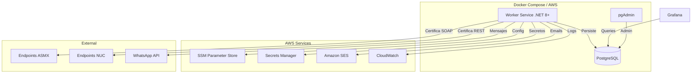

<div align="center">


# 🔍 RegionalCertMonitor

**Servicio unificado de monitoreo de certificación electrónica para Centroamérica y el Caribe**

[](https://dotnet.microsoft.com/)
[](https://www.postgresql.org/)
[](https://docs.docker.com/compose/)
[](https://grafana.com/)
[]()

---

*Monitorea la disponibilidad y tiempos de respuesta de los servicios de facturación electrónica*
*de Digifact en **Guatemala, El Salvador, República Dominicana, Costa Rica y Panamá**.*

</div>

---

## 🎯 ¿Qué es?

RegionalCertMonitor reemplaza **5 servicios de monitoreo independientes** (uno por país) con un único Worker Service en .NET 8+. Cada servicio anterior era una copia con código duplicado, credenciales hardcodeadas y sin tests.

Este proyecto unifica todo en una arquitectura limpia, configurable por país, con:

- 📡 Certificaciones de prueba ASMX (SOAP) y NUC (REST) por país
- 💾 Persistencia de resultados en PostgreSQL
- 📊 Dashboards en Grafana conectados directamente a PostgreSQL
- 📧 Alertas por Email (Amazon SES) y WhatsApp con control manual
- 🔒 Kill switch global y por país/canal para notificaciones
- 🛡️ Resiliencia con Polly (retry, circuit breaker, timeouts)
- 📝 Logging estructurado con Serilog → CloudWatch

## 🏗️ Arquitectura



## 🛠️ Tech Stack

| Componente | Tecnología |
|---|---|
| Runtime | .NET 8+ Worker Service (Linux containers) |
| Base de datos | PostgreSQL 16 (Docker local / RDS producción) |
| Dashboards | Grafana (instancia existente) |
| Admin local | pgAdmin 4 |
| Resiliencia | Polly v8+ (retry, circuit breaker, timeout) |
| Logging | Serilog + CloudWatch sink |
| Notificaciones | Amazon SES + WhatsApp Graph API v17.0 |
| Config & Secrets | SSM Parameter Store + Secrets Manager |
| Testing | xUnit + FsCheck (property-based) + Testcontainers |
| CI/CD | GitHub Actions → Amazon ECR |
| IaC (opcional) | AWS CDK en C# (ECS Fargate) |
| Driver DB | Npgsql con connection pooling |

## 🚀 Quick Start

### Prerrequisitos

- [.NET 8+ SDK](https://dotnet.microsoft.com/download)
- [Docker Desktop](https://www.docker.com/products/docker-desktop/)

### Levantar el stack completo

```bash
# Clonar el repo
git clone https://github.com/alehernandezdf/RegionalCertMonitor.git
cd RegionalCertMonitor

# Configurar variables de ambiente
cp .env.example .env
# Editar .env con tus credenciales

# Levantar todo con Docker Compose
docker compose up -d
```

Esto levanta:
- **Worker Service** en .NET 8+ (monitoreo activo)
- **PostgreSQL 16** en puerto `5432` (datos de monitoreo)
- **pgAdmin** en puerto `5050` (admin visual para desarrollo)

### Acceder a pgAdmin

1. Abrir `http://localhost:5050`
2. La conexión a PostgreSQL ya está preconfigurada
3. Usar las queries en `src/Monitoreo.Worker/Queries/test-queries.sql` para ver resultados

### Conectar Grafana

Agregar PostgreSQL como datasource en tu instancia de Grafana existente:
- Host: `<host-postgresql>:5432`
- Database: `monitoring`
- User: `monitoreo`

Importar el dashboard desde `src/Monitoreo.Worker/Grafana/dashboard.json`.

## 📁 Estructura del Proyecto

```
RegionalCertMonitor/
├── src/
│   ├── Monitoreo.Worker/              # Worker Service principal
│   │   ├── Workers/                   # BackgroundService por país
│   │   ├── Services/
│   │   │   ├── Certification/         # ASMX + NUC
│   │   │   ├── Notification/          # Email + WhatsApp + Gate
│   │   │   ├── Persistence/           # PostgreSQL repository
│   │   │   ├── Configuration/         # SSM + Secrets Manager
│   │   │   ├── Retention/             # Limpieza automática
│   │   │   └── Orchestration/         # Coordinador de ciclos
│   │   ├── Models/                    # Domain models
│   │   ├── Templates/                 # XML por país (GT,SV,DO,CR,PA)
│   │   ├── Database/                  # init.sql
│   │   ├── Grafana/                   # Dashboard JSON
│   │   └── Queries/                   # SQL para pruebas locales
│   └── Monitoreo.Infrastructure/      # CDK Stack (opcional)
├── tests/
│   ├── Monitoreo.Worker.UnitTests/    # xUnit + FsCheck
│   └── Monitoreo.Worker.IntegrationTests/  # Testcontainers
├── .github/workflows/                 # CI/CD
├── docker-compose.yml
├── pgadmin-servers.json
└── docs/                              # Especificaciones
    ├── requirements.md
    ├── design.md
    └── tasks.md
```

## 🌎 Países Soportados

| País | Código | ASMX | NUC |
|---|---|---|---|
| 🇬🇹 Guatemala | GT | ✅ | ✅ |
| 🇸🇻 El Salvador | SV | ✅ | ✅ |
| 🇩🇴 República Dominicana | DO | ✅ | ✅ |
| 🇨🇷 Costa Rica | CR | ✅ | ✅ |
| 🇵🇦 Panamá | PA | ✅ | ✅ |

Cada país tiene su propia configuración de endpoints, intervalos, plantillas XML y destinatarios de alertas.

## 🔔 Control de Notificaciones

El sistema incluye control manual granular sobre las notificaciones:

- **Kill switch global**: Desactiva todas las notificaciones con un solo parámetro en SSM
- **Toggle por país/canal**: Activa o desactiva Email y WhatsApp independientemente por país
- **Cooldown configurable**: Evita spam cuando un servicio está intermitente
- **Sin reinicio**: Los cambios en SSM se detectan en el siguiente ciclo automáticamente

El monitoreo y la persistencia de datos **siempre continúan**, independientemente del estado de las notificaciones.

## 📊 Dashboards

El dashboard de Grafana incluye:

- Disponibilidad por país (% éxito últimas 24h)
- Tiempos de respuesta (series de tiempo por país/tipo)
- Alertas activas (últimos fallos y degradaciones)
- Tendencias (promedios por hora y día)
- Filtros interactivos por país, tipo de certificación y rango de tiempo

## 🧪 Testing

```bash
# Tests unitarios
dotnet test tests/Monitoreo.Worker.UnitTests/

# Tests de integración (requiere Docker)
dotnet test tests/Monitoreo.Worker.IntegrationTests/
```

El proyecto usa **property-based testing** con FsCheck para validar 14 propiedades de correctitud formales que cubren desde la lógica de certificación hasta el control de notificaciones.

## 📖 Documentación

| Documento | Descripción |
|---|---|
| [Requirements](docs/requirements.md) | Requerimientos funcionales y criterios de aceptación |
| [Design](docs/design.md) | Arquitectura, componentes, modelos de datos y propiedades de correctitud |
| [Tasks](docs/tasks.md) | Plan de implementación con tareas detalladas |

## 🏢 Digifact TaxTech

<div align="center">

Desarrollado por el equipo de operaciones de **Digifact** para monitorear
la infraestructura de facturación electrónica en la región.

`Namespace: Digifact.RegionalCertMonitor`

</div>
