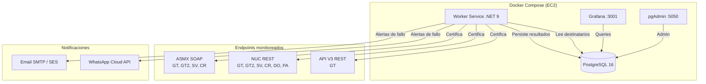

<div align="center">


# 🔍 RegionalCertMonitor

**Servicio unificado de monitoreo de certificación electrónica para Centroamérica y el Caribe**

[](https://dotnet.microsoft.com/)
[](https://www.postgresql.org/)
[](https://docs.docker.com/compose/)
[](https://grafana.com/)
[]()

---

*Monitorea la disponibilidad y tiempos de respuesta de los servicios de facturación electrónica*
*de Digifact en **Guatemala, El Salvador, República Dominicana, Costa Rica y Panamá**.*

</div>

---

## 🎯 ¿Qué es?

RegionalCertMonitor reemplaza **5 servicios de monitoreo independientes** (uno por país) con un único Worker Service en .NET 9. Cada servicio anterior era una copia con código duplicado, credenciales hardcodeadas y sin tests.

Cada 60 segundos ejecuta certificaciones de prueba reales contra los endpoints productivos de cada país y guarda el resultado (OK/FAIL + tiempo de respuesta). Todo corre en un solo `docker compose` (worker + PostgreSQL + Grafana + pgAdmin).

- 📡 Certificaciones de prueba **ASMX** (SOAP), **NUC** (REST) y **API V3** (REST, solo GT)
- 💾 Persistencia de resultados en PostgreSQL con contadores secuenciales atómicos por país/tipo
- 📊 Grafana incluido en el stack, con datasource y dashboards auto-provisionados
- 📧 Alertas por Email (SMTP/Amazon SES) y WhatsApp (Meta Cloud API) **solo cuando hay fallos**
- 👥 Destinatarios de alertas en base de datos, parametrizables **por país** y por canal, sin redeploy
- 🧪 Disparador manual de alertas de prueba (`INSERT` en `alert_test_queue`)
- 🛡️ Resiliencia con Polly (retry, circuit breaker, timeouts) y cooldown anti-spam configurable
- 📝 Logging estructurado con Serilog (consola; CloudWatch opcional en modo Production)

## 🏗️ Arquitectura



## 🛠️ Tech Stack

| Componente | Tecnología |
|---|---|
| Runtime | .NET 9 Worker Service (Linux containers, Alpine) |
| Base de datos | PostgreSQL 16 (contenedor del mismo compose) |
| Dashboards | Grafana (contenedor del mismo compose, puerto `3001`) |
| Admin local | pgAdmin 4 (puerto `5050`) |
| Resiliencia | Polly v8 (retry, circuit breaker, timeout) |
| Logging | Serilog (consola; sink CloudWatch en Production) |
| Notificaciones | Email vía SMTP (Amazon SES) + WhatsApp Graph API |
| Testing | xUnit + FsCheck (property-based) + Testcontainers |
| Driver DB | Npgsql con connection pooling |

## 🚀 Quick Start

### Prerrequisitos

- [.NET 9 SDK](https://dotnet.microsoft.com/download) (solo para desarrollo/tests)
- [Docker Desktop](https://www.docker.com/products/docker-desktop/)

### Levantar el stack completo

```bash
git clone https://github.com/alehernandezdf/RegionalCertMonitor.git
cd RegionalCertMonitor
docker compose up -d --build
```

Esto levanta:
- **monitoreo-worker** — el Worker Service (monitoreo activo cada 60s)
- **monitoreo-postgres** — PostgreSQL 16 en puerto `5432` (crea tablas con `init.sql` en el primer arranque)
- **monitoreo-grafana** — Grafana en puerto `3001` con datasource y dashboards ya provisionados
- **monitoreo-pgadmin** — pgAdmin en puerto `5050` con la conexión preconfigurada

Las credenciales SMTP y de WhatsApp viven en `src/Monitoreo.Worker/appsettings.Secrets.json` (montado al contenedor; el repo es privado).

> ⚠️ **Cuidado al correr localmente**: el worker apunta a los endpoints productivos y **puede enviar alertas reales al equipo**. Para pruebas locales usa un `docker-compose.override.yml` (no se versiona) que deshabilite países y/o notificaciones, y evita chocar contadores con el servidor.

### Acceder a Grafana

1. Abrir `http://localhost:3001` (en el server: puerto `3001` de la instancia)
2. El dashboard principal carga como home por defecto
3. Dashboards disponibles: **monitoreo** (regional) y **monitoreo-pais** (detalle por país)

### Acceder a pgAdmin

1. Abrir `http://localhost:5050`
2. La conexión a PostgreSQL ya está preconfigurada (`pgadmin-servers.json`)
3. Usar las queries en `src/Monitoreo.Worker/Queries/` para revisar resultados

## 📁 Estructura del Proyecto

```
RegionalCertMonitor/
├── src/
│   └── Monitoreo.Worker/              # Worker Service principal
│       ├── Workers/                   # CountryMonitoringWorker (uno por país) + TestAlertWorker
│       ├── Services/
│       │   ├── Certification/         # ASMX + NUC + API V3, firma PFX, QR, CUFE
│       │   ├── Notification/          # Email + WhatsApp + gate (flags/cooldown) + destinatarios en BD
│       │   ├── Persistence/           # Repositorio PostgreSQL + contadores secuenciales
│       │   ├── Configuration/         # Config por país (appsettings.{PAIS}.json / AWS)
│       │   ├── Observability/         # Métricas (consola / CloudWatch)
│       │   ├── Orchestration/         # Coordinador de ciclos y alertas
│       │   └── Retention/             # Limpieza automática de datos viejos
│       ├── Models/                    # Domain models
│       ├── Database/                  # init.sql (tablas, índices, seeds)
│       ├── Grafana/                   # Dashboard JSON (referencia)
│       ├── Queries/                   # SQL para revisión manual
│       └── appsettings*.json          # Config global + por país + Secrets
├── templates_xml_json/                # ⭐ Templates XML/JSON por país (fuente de verdad)
│   ├── GT/  ├── SV/  ├── CR/  ├── DO/  └── PA/
├── grafana/
│   ├── provisioning/                  # Datasource + carga automática de dashboards
│   ├── dashboards/                    # monitoreo.json + monitoreo-pais.json
│   └── flags/                         # Banderas usadas por los dashboards
├── tests/
│   ├── Monitoreo.Worker.UnitTests/    # xUnit + FsCheck
│   └── Monitoreo.Worker.IntegrationTests/  # Testcontainers
├── infra/Monitoreo.Infrastructure/    # CDK Stack (opcional, no desplegado)
├── docs/                              # requirements.md, design.md, tasks.md
├── .github/workflows/                 # CI
├── docker-compose.yml
├── Dockerfile
├── pgadmin-servers.json
└── ServicioMonitoreo.sln
```

### 📄 Templates (`templates_xml_json/`)

Los templates son la **fuente de verdad** de los datos fijos de cada documento (emisor, sucursal, establecimiento, etc.). El código solo inyecta las partes dinámicas: fecha de emisión, correlativo/secuencial (contador atómico en BD) y GUID donde aplica.

- Se montan al contenedor como `/app/Templates` (docker-compose) y además se hornean en la imagen como respaldo.
- Si un país cambia datos del documento (ej. CR cambió sucursal 000→001), **se edita el template y se recrea el contenedor** — sin tocar código.

## 🌎 Países Soportados

| País | Código | ASMX | NUC | API V3 |
|---|---|---|---|---|
| 🇬🇹 Guatemala | GT | ✅ | ✅ | ✅ |
| 🇬🇹 Guatemala (endpoint alterno `.com.gt`) | GT2 | ✅ | ✅ | — |
| 🇸🇻 El Salvador | SV | ✅ | ✅ | — |
| 🇨🇷 Costa Rica | CR | ✅ | ✅ | — |
| 🇩🇴 República Dominicana | DO | — | ✅ | — |
| 🇵🇦 Panamá | PA | — | ✅ | — |

Cada país tiene su propio `appsettings.{PAIS}.json` con endpoints, credenciales de referencia, intervalo, umbral de alerta y flags de notificación.

## 🔔 Alertas y Notificaciones

Solo se alerta cuando una certificación **falla** (error o rechazo); la lentitud se registra pero no alerta.

### Destinatarios en base de datos (`notification_recipients`)

Se agregan/quitan destinatarios **sin redeploy**, parametrizables por país y canal:

```sql
-- Recibe alertas de TODOS los países:
INSERT INTO notification_recipients (country, channel, destination) VALUES ('*', 'email', 'nuevo@digifact.com');

-- Recibe alertas SOLO de Panamá:
INSERT INTO notification_recipients (country, channel, destination) VALUES ('PA', 'whatsapp', '50761234567');

-- Desactivar sin borrar:
UPDATE notification_recipients SET enabled = false WHERE destination = 'fulano@digifact.com';
```

Si la BD no responde, el worker cae de vuelta a las listas de `appsettings.{PAIS}.json`.

### Prueba manual de alertas (`alert_test_queue`)

```sql
INSERT INTO alert_test_queue (channel) VALUES ('email');  -- 'email' | 'whatsapp' | 'all'
```

El worker la consume en ≤15 segundos y envía una alerta de PRUEBA a los destinatarios globales (`country = '*'`).

### Controles adicionales

- **Flags por país/canal** (`NotificationsEmailEnabled` / `NotificationsWhatsAppEnabled` en appsettings)
- **Cooldown configurable** por país para evitar spam cuando un servicio está intermitente
- El monitoreo y la persistencia **siempre continúan**, independientemente del estado de las notificaciones

## 📊 Dashboards

Grafana se auto-provisiona al levantar el compose (datasource PostgreSQL + dashboards):

- **monitoreo.json** — vista regional: disponibilidad por país, tiempos de respuesta, últimos fallos
- **monitoreo-pais.json** — detalle por país con filtros por tipo de certificación y rango de tiempo

## 🧪 Testing

```bash
# Tests unitarios
dotnet test tests/Monitoreo.Worker.UnitTests/

# Tests de integración (requiere Docker)
dotnet test tests/Monitoreo.Worker.IntegrationTests/
```

El proyecto usa **property-based testing** con FsCheck para validar propiedades de correctitud que cubren desde la lógica de certificación hasta el control de notificaciones.

## 📖 Documentación

| Documento | Descripción |
|---|---|
| [Requirements](docs/requirements.md) | Requerimientos funcionales y criterios de aceptación |
| [Design](docs/design.md) | Arquitectura, componentes, modelos de datos y propiedades de correctitud |
| [Tasks](docs/tasks.md) | Plan de implementación con tareas detalladas |

> 🔄 **Mantener actualizado**: si un cambio mueve carpetas, agrega tablas, países o features, este README debe actualizarse en el mismo PR.

## 🏢 Digifact TaxTech

<div align="center">

Desarrollado por el equipo de operaciones de **Digifact** para monitorear
la infraestructura de facturación electrónica en la región.

`Namespace: Digifact.RegionalCertMonitor`

</div>
